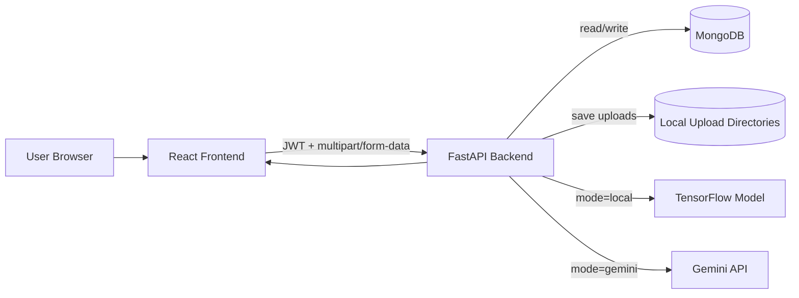
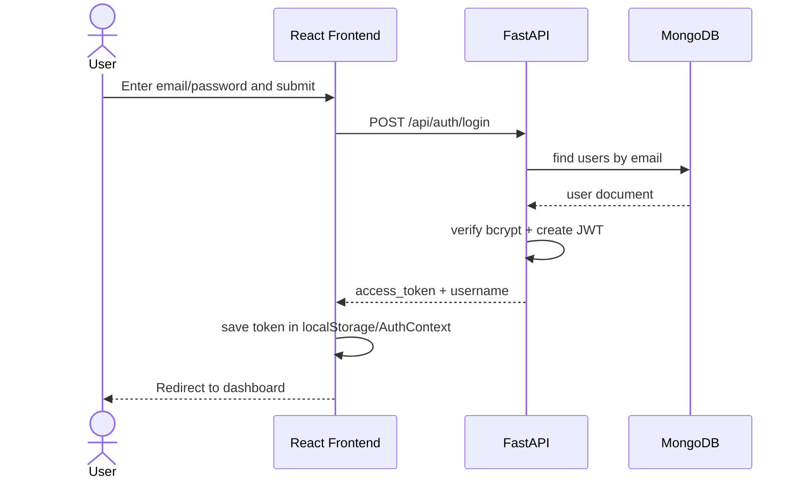
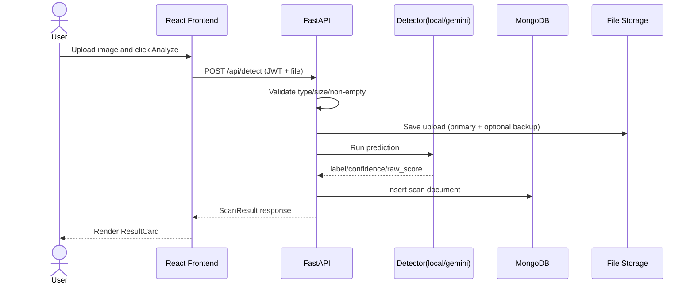
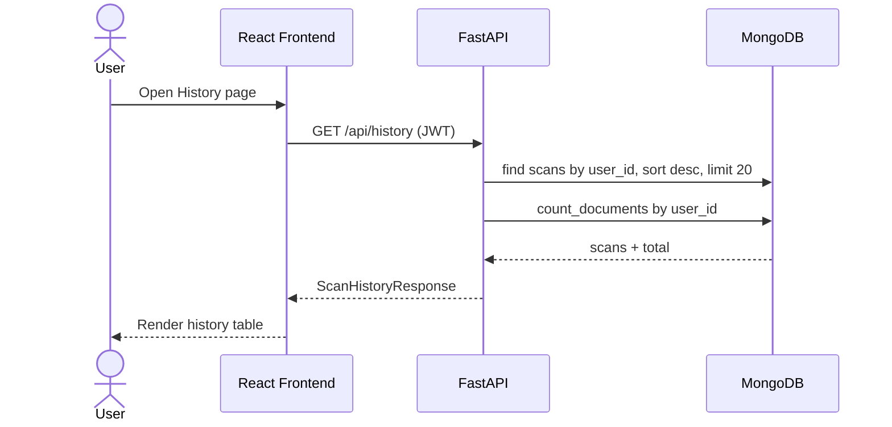

# Deepfake Detector - Comprehensive Project Details

## 1. Project Summary

Deepfake Detector is a full-stack web application that classifies uploaded images as REAL or FAKE and stores per-user scan history.

The implementation uses:

- Backend: FastAPI (async), Motor (MongoDB), JWT auth, optional local TensorFlow model, optional Gemini-based detection.
- Frontend: React + Vite + Tailwind CSS, React Router, Axios, React Hook Form.
- Database: MongoDB Atlas with two primary collections: users and scans.

Primary business value:

1. Authenticated users can upload images and run deepfake detection.
2. The system returns label + confidence + score and saves each scan.
3. Users can review recent detection history tied to their account.

Current behavior is implementation-driven (from code), not only blueprint-driven.

## 2. Scope and Functional Boundaries

### 2.1 In Scope

1. User registration and login with JWT bearer token.
2. Protected detection endpoint accepting image upload (JPG/PNG/WEBP, <= 5 MB).
3. Two detection backends selected by environment variable:
   - local (TensorFlow model inference)
   - gemini (Gemini API forensic prompt strategy)
4. Scan history retrieval for authenticated user.
5. Upload persistence on local filesystem.
6. Optional parallel backup copy of uploaded image.

### 2.2 Out of Scope (Current Implementation)

1. Video deepfake detection.
2. OAuth/social login.
3. Role-based authorization or admin panel.
4. Password reset/email verification.
5. Token refresh flow and token revocation list.
6. Cloud object storage abstraction (S3/GCS/etc.).

## 3. High-Level Architecture

## 3.1 Component View

1. React frontend handles auth UI, upload UI, and history table.
2. FastAPI backend handles auth, validation, detection orchestration, and persistence.
3. MongoDB stores users and scan metadata/results.
4. Filesystem stores uploaded original images.
5. Detection provider is pluggable by environment:
   - local TensorFlow model
   - Gemini API

## 3.2 Runtime Data Flow



## 4. Detailed Directory and Module Responsibilities

## 4.1 Backend

- app/main.py: FastAPI app assembly, CORS, startup/shutdown lifecycle, router mounting.
- app/config.py: Settings model loaded from backend/.env.
- app/db/mongo.py: Shared async MongoDB client and database accessor.
- app/routes/auth.py: Register/login HTTP endpoints.
- app/routes/detection.py: Detect and history HTTP endpoints.
- app/middleware/auth_middleware.py: JWT bearer validation and current user resolution.
- app/services/auth_service.py: Hash/verify password, JWT create/decode, user auth logic.
- app/services/detection_service.py: File handling, mode switch, prediction call, scan persistence.
- app/services/gemini_detection_service.py: Prompt/config building, Gemini API call, output normalization.
- app/services/history_service.py: User scan list query and total count.
- app/ml/model_loader.py: Model load/download logic and local prediction function.
- app/ml/preprocessor.py: PIL/OpenCV pipeline for validation, optional face crop, resize, normalize.
- setup_indexes.py: Creates DB indexes for users/scans.

## 4.2 Frontend

- src/App.jsx: Routes and protected route setup.
- src/context/AuthContext.jsx: Global auth state and localStorage synchronization.
- src/api/axiosInstance.js: Base API URL, token interceptor, 401 auto-redirect behavior.
- src/pages/LoginPage.jsx: Login form and submit flow.
- src/pages/RegisterPage.jsx: Registration form and post-success redirect.
- src/pages/DashboardPage.jsx: Upload, local validation, detect request, result rendering.
- src/pages/HistoryPage.jsx: Fetch and render scan history.
- src/components/*: Navbar, uploader, result card, history table, spinner, protected route.

## 4.3 ML Training Scripts

- backend/ml_training/dataset_prep.py: Split raw dataset into train/validation/test.
- backend/ml_training/train.py: Transfer-learning training and fine-tuning.
- backend/ml_training/evaluate.py: Offline test-set evaluation.

## 5. Configuration Model (backend/.env Contract)

The backend settings object defines the following environment contract:

| Key | Type | Purpose |
|---|---|---|
| MONGO_URI | str | MongoDB Atlas/cluster connection URI |
| DATABASE_NAME | str | MongoDB database name |
| JWT_SECRET_KEY | str | JWT signing key |
| JWT_ALGORITHM | str | JWT signing algorithm (default HS256) |
| JWT_ACCESS_TOKEN_EXPIRE_MINUTES | int | Access token expiration window |
| MODEL_PATH | str | Relative/absolute path to .h5 model |
| MODEL_AUTO_DOWNLOAD | bool | Auto-download model on startup if missing |
| MODEL_DOWNLOAD_URL | str/None | Model URL for auto-download |
| MODEL_DOWNLOAD_TIMEOUT_SECONDS | int | Download timeout |
| MODEL_SHA256 | str/None | Optional checksum verification |
| ALLOW_API_START_WITHOUT_MODEL | bool | Allow app startup if local model unavailable |
| DETECTION_METHOD | str | local or gemini |
| GEMINI_API_KEY | str/None | Gemini API key |
| GEMINI_MODEL | str | Gemini model name |
| GEMINI_TIMEOUT_SECONDS | int | Gemini HTTP timeout |
| GEMINI_DETECTION_CONFIG_PATH | str | JSON config path for forensic prompt behavior |
| UPLOAD_DIR | str | Primary upload directory |
| PARALLEL_BACKEND_SAVE_ENABLED | bool | Save additional backup copy |
| PARALLEL_BACKEND_SAVE_DIR | str | Backup directory path |

Observed runtime choice in current backend/.env: DETECTION_METHOD=gemini.

## 6. Backend Startup and Lifecycle

Lifespan handler behavior:

1. Read DETECTION_METHOD and normalize lowercase.
2. If local mode:
   - Resolve MODEL_PATH to absolute path.
   - Attempt to load model via app/ml/model_loader.py.
   - If model load fails and ALLOW_API_START_WITHOUT_MODEL=true, mark model unavailable and continue startup.
   - Else raise startup error.
3. If gemini mode:
   - Log selected Gemini model.
   - Warn if GEMINI_API_KEY missing.
4. On shutdown, close MongoDB client.

Operational implication:

- API can be up while local model is unavailable; detection then fails with service-unavailable path until model issue resolved.

## 7. API Contract (Current Implementation)

Base URL example: http://localhost:8000

## 7.1 Authentication Endpoints

### POST /api/auth/register

Request body schema:

```json
{
  "username": "string (3-30)",
  "email": "valid email",
  "password": "string (min 6)"
}
```

Success response (201):

```json
{
  "id": "user_object_id_as_string",
  "username": "string",
  "email": "string",
  "created_at": "ISO datetime"
}
```

Error response examples:

- 400: email already exists or validation/business error.

### POST /api/auth/login

Request body schema:

```json
{
  "email": "valid email",
  "password": "string"
}
```

Success response (200):

```json
{
  "access_token": "jwt",
  "token_type": "bearer",
  "username": "string"
}
```

Error response examples:

- 401: invalid credentials.

## 7.2 Detection Endpoints

### POST /api/detect (Protected)

Auth:

- Requires Authorization: Bearer <token>.

Request:

- multipart/form-data
- field name: file

Validation rules:

1. Allowed content types: image/jpeg, image/png, image/webp.
2. Max file size: 5 MB.
3. Empty file rejected.

Success response (200):

```json
{
  "scan_id": "uuid",
  "label": "REAL or FAKE",
  "confidence": 0.0,
  "raw_score": 0.0,
  "filename": "original client filename",
  "scanned_at": "ISO datetime"
}
```

Error response examples:

- 400: invalid file type, empty file, parse/preprocess errors.
- 401: missing/invalid token.
- 413: payload too large.
- 503: detection backend unavailable (for example missing model or missing Gemini key).
- 500: unexpected error.

### GET /api/history (Protected)

Auth:

- Requires Authorization: Bearer <token>.

Success response (200):

```json
{
  "scans": [
    {
      "scan_id": "uuid",
      "label": "REAL or FAKE",
      "confidence": 0.0,
      "filename": "string",
      "scanned_at": "ISO datetime"
    }
  ],
  "total": 0
}
```

Behavior:

- Returns latest scans first (descending scanned_at).
- Service defaults to limit=20 records while total counts all user scans.

## 7.3 Utility Endpoint

### GET /

Returns service heartbeat payload:

```json
{
  "message": "Deepfake Detection API is running.",
  "status": "ok"
}
```

## 8. Authentication and Authorization Internals

## 8.1 Password Storage

1. Uses passlib CryptContext with bcrypt.
2. Stored field is password_hash, never plain password.

## 8.2 JWT Token Model

1. Token subject claim sub stores user _id string.
2. exp claim is generated using configured expiration minutes.
3. Signed with JWT_SECRET_KEY and JWT_ALGORITHM.

## 8.3 Protected Route Resolution

1. HTTPBearer extracts bearer token.
2. decode_token validates signature and expiration.
3. sub converted to BSON ObjectId.
4. users collection queried by _id.
5. On success returns current user dict: id, username, email.

401 cases include invalid/expired token, malformed ObjectId, or missing user.

## 9. Detection Pipeline (Service Layer)

## 9.1 File Handling and Persistence

For each detection request:

1. Determine extension from original filename; fallback .jpg.
2. Generate unique save filename using UUID + extension.
3. Resolve primary upload path from UPLOAD_DIR.
4. If PARALLEL_BACKEND_SAVE_ENABLED=true, resolve secondary directory and include in write targets.
5. Write bytes asynchronously to all target paths using aiofiles + asyncio.gather.

Persisted scan document includes:

- scan_id (uuid)
- user_id (string)
- filename (original name)
- saved_as (generated unique filename)
- label, confidence, raw_score
- scanned_at (UTC datetime)

## 9.2 Detection Method Switch

Configured via DETECTION_METHOD:

1. gemini:
   - Calls predict_with_gemini(file_bytes, mime_type)
2. local:
   - Preprocess image with full_preprocess_pipeline
   - Predict with TensorFlow model_loader.predict

Unsupported value throws runtime error.

## 10. Local ML Inference Details

## 10.1 Preprocessing Steps

1. PIL opens bytes and converts to RGB.
2. Convert RGB to OpenCV BGR.
3. Haar cascade face detection on grayscale image.
4. If faces found, crop largest face with margin.
5. Resize to 224x224.
6. Convert BGR to RGB.
7. Normalize pixel values to [0,1].
8. Add batch dimension (1, 224, 224, 3).

## 10.2 Prediction Semantics

Model output is single sigmoid value raw_score.

- If raw_score > 0.5 => label REAL, confidence = raw_score * 100.
- Else => label FAKE, confidence = (1 - raw_score) * 100.

Important: in local mode, higher raw_score means more likely REAL.

## 10.3 Model Availability Strategy

Model loader supports:

1. Direct load from MODEL_PATH.
2. Optional startup download if missing and MODEL_AUTO_DOWNLOAD=true.
3. Optional SHA256 verification for downloaded artifact.

If model cannot load and startup is allowed without model, detection calls will fail with runtime-unavailable behavior until fixed.

## 11. Gemini Detection Details

Gemini detection is configurable via app/configs/gemini_detection_config.json merged over defaults.

## 11.1 Configurable Prompt Strategy

Config sections:

1. role_prompt
2. focus_areas (name, weight, checks)
3. decision_policy:
   - minimum_real_confidence
   - fallback_label_for_uncertain
   - uncertain_confidence_threshold
4. extra_instructions
5. generation_config (temperature, topP, topK, maxOutputTokens, etc.)

## 11.2 Gemini Response Normalization

Pipeline:

1. Extract candidate text from API response.
2. Parse JSON (supports fenced blocks and partial extraction fallback).
3. Normalize label to REAL/FAKE.
4. Normalize confidence and raw_score ranges.
5. Apply decision policy:
   - If Gemini says REAL but confidence < minimum_real_confidence, switch to fallback label (default FAKE).

This conservative policy intentionally reduces false-real outcomes under uncertainty.

## 12. Database Model and Relationships

## 12.1 Collection: users

Example shape:

```json
{
  "_id": "ObjectId",
  "username": "string",
  "email": "string",
  "password_hash": "bcrypt hash",
  "created_at": "datetime"
}
```

Field details:

| Field | Type | Required | Notes |
|---|---|---|---|
| _id | ObjectId | yes | Mongo generated primary key |
| username | string | yes | Not unique at DB level currently |
| email | string | yes | Unique index enforced |
| password_hash | string | yes | Bcrypt hash |
| created_at | datetime | yes | UTC timestamp |

Indexes:

1. unique index on email.

## 12.2 Collection: scans

Example shape:

```json
{
  "_id": "ObjectId",
  "scan_id": "uuid string",
  "user_id": "string (users._id as string)",
  "filename": "original filename",
  "saved_as": "uuid_with_extension",
  "label": "REAL or FAKE",
  "confidence": 0.0,
  "raw_score": 0.0,
  "scanned_at": "datetime"
}
```

Field details:

| Field | Type | Required | Notes |
|---|---|---|---|
| _id | ObjectId | yes | Mongo generated primary key |
| scan_id | string (uuid) | yes | API-facing scan identifier |
| user_id | string | yes | Logical FK to users._id serialized as string |
| filename | string | yes | Original upload filename |
| saved_as | string | yes | Stored file name in upload directory |
| label | string | yes | REAL or FAKE |
| confidence | float | yes | 0-100 |
| raw_score | float | yes | 0-1 semantic depends on detector normalization |
| scanned_at | datetime | yes | UTC timestamp |

Indexes:

1. index on user_id.
2. compound index on (user_id asc, scanned_at desc) for history query optimization.

## 12.3 Entity Relationship Model

```mermaid
erDiagram
    USERS ||--o{ SCANS : "has many"

    USERS {
        ObjectId _id PK
        string username
        string email UNIQUE
        string password_hash
        datetime created_at
    }

    SCANS {
        ObjectId _id PK
        string scan_id
        string user_id "ref USERS._id as string"
        string filename
        string saved_as
        string label
        float confidence
        float raw_score
        datetime scanned_at
    }
```

Relationship semantics:

1. One user can own zero or many scans.
2. Each scan belongs to exactly one logical user by user_id.
3. MongoDB does not enforce foreign keys; referential integrity is application-managed.

## 12.4 Referential Integrity Considerations

Current tradeoffs:

1. user_id in scans is stored as string, not ObjectId type.
2. No cascade delete logic in service layer.
3. No uniqueness constraint currently on scan_id.

These are acceptable for small deployments, but worth hardening for production scale.

## 13. Frontend Functional Design and Use Cases

## 13.1 Routing and Access Control

Routes:

1. /login
2. /register
3. /dashboard (protected)
4. /history (protected)
5. / redirects to /dashboard
6. unknown paths redirect to /login

Protection logic:

- ProtectedRoute allows access only when AuthContext has a token.

## 13.2 Auth State Model

AuthContext values:

1. token
2. username
3. isAuthenticated
4. login(accessToken, username)
5. logout()

Persistence:

- access_token and username stored in localStorage.
- Axios request interceptor adds Authorization header automatically.
- Axios response interceptor on 401 clears auth and redirects to /login.

## 13.3 Dashboard Use Case

User journey:

1. Select or drag-drop image.
2. Client-side validation checks type and 5 MB size.
3. Show preview image.
4. User triggers Analyze Image.
5. POST /api/detect with multipart form.
6. Show loading spinner while waiting.
7. Show ResultCard with label/confidence/time.
8. User can reset and analyze another image.

## 13.4 History Use Case

User journey:

1. Visit history page.
2. Frontend calls GET /api/history once on mount.
3. While loading, spinner is shown.
4. If empty, show no-scans placeholder.
5. Else render tabular rows of filename, label, confidence, date.

## 14. Detailed Use Case Catalog

| ID | Use Case | Actor | Preconditions | Main Success Path | Failure Paths |
|---|---|---|---|---|---|
| UC-01 | Register account | New user | Valid internet + backend up | Submit register form -> 201 -> account created | Duplicate email -> 400 |
| UC-02 | Login | Existing user | Registered account | Submit credentials -> token returned -> redirect dashboard | Invalid credentials -> 401 |
| UC-03 | Access protected dashboard | Authenticated user | Token in storage | Route allows render | Missing/expired token -> redirect login |
| UC-04 | Upload valid image | Authenticated user | JPG/PNG/WEBP <= 5 MB | File selected and preview shown | Invalid type/oversize blocked client-side |
| UC-05 | Run detection (gemini mode) | Authenticated user | GEMINI_API_KEY valid | API returns REAL/FAKE payload and scan persisted | Gemini timeout/error -> 503/500 |
| UC-06 | Run detection (local mode) | Authenticated user | Model loaded and available | Preprocess -> model predict -> persist -> response | Model unavailable -> 503 |
| UC-07 | Save primary upload file | Backend | Writable upload dir | File bytes saved to UPLOAD_DIR | IO errors bubble into failure path |
| UC-08 | Save parallel backup upload | Backend | Parallel save enabled | Additional copy saved to PARALLEL_BACKEND_SAVE_DIR | Secondary write issue causes request failure |
| UC-09 | Fetch scan history | Authenticated user | Existing scans optional | API returns latest scans + total | Auth failure -> 401 |
| UC-10 | Handle expired token | Frontend + backend | Token expired | Backend returns 401 -> frontend clears storage and redirects | User must re-login |
| UC-11 | Startup with missing local model | Backend operator | local mode selected | If allowed, API starts and logs warning | If not allowed, startup error |
| UC-12 | Setup DB indexes | Operator | Mongo config valid | Run setup_indexes.py and indexes created | Missing env or DB issues raise errors |

## 15. ML Training and Evaluation Details

## 15.1 Dataset Preparation

dataset_prep.py behavior:

1. Reads source directories:
   - dataset/raw/real
   - dataset/raw/fake
2. Filters image extensions (jpg/jpeg/png/webp).
3. Shuffles with fixed random seed 42.
4. Splits into:
   - train 75%
   - validation 15%
   - test 10%
5. Copies into dataset/train|validation|test/<label>.

## 15.2 Training Pipeline

train.py strategy:

1. Image size 224, batch size 32, initial epochs 20.
2. Data augmentation on train set:
   - horizontal flip
   - small rotation, zoom, width/height shifts
3. EfficientNetB0 backbone (ImageNet pretrained, include_top=False).
4. Custom head:
   - GlobalAveragePooling2D
   - Dense(256, relu)
   - Dropout(0.4)
   - Dense(1, sigmoid)
5. Phase 1: backbone frozen, Adam lr=1e-4.
6. Phase 2: unfreeze top 20 backbone layers, Adam lr=1e-5.
7. Callbacks:
   - EarlyStopping on val_loss (patience 5)
   - ReduceLROnPlateau on val_loss
   - ModelCheckpoint on best val_accuracy
8. Output model: backend/saved_model/efficientnet_deepfake.h5.

## 15.3 Evaluation Pipeline

evaluate.py:

1. Loads saved model.
2. Creates test generator from dataset/test.
3. Evaluates loss and accuracy.
4. Prints class index mapping from generator.

## 16. End-to-End Sequence Diagrams

## 16.1 Login Sequence



## 16.2 Detection Sequence



## 16.3 History Sequence



## 17. Error Handling and Status Mapping

| Layer | Condition | Outcome |
|---|---|---|
| Auth route | Duplicate email | 400 |
| Auth route | Invalid credentials | 401 |
| Auth middleware | Invalid/expired token | 401 |
| Detect route | Invalid MIME type | 400 |
| Detect route | Empty file | 400 |
| Detect route | File > 5 MB | 413 |
| Detection service | Unsupported DETECTION_METHOD | 503 path via RuntimeError mapping |
| Local model | Not loaded/unavailable | 503 |
| Gemini service | API key missing/network/API error | 503/500 depending call path |
| Generic unexpected exception | Unhandled runtime issue | 500 |

## 18. Security and Compliance Notes

## 18.1 Security Features Present

1. Password hashing via bcrypt.
2. JWT expiration claim.
3. Protected backend routes with bearer auth.
4. CORS restricted to frontend dev origin http://localhost:5173.

## 18.2 Security Risks and Gaps

1. Access token stored in localStorage (XSS-sensitive storage).
2. No refresh token strategy.
3. No brute-force/rate-limiting controls on auth endpoints.
4. No CSRF model needed for bearer header design, but XSS hardening remains critical.
5. Current environment file contains real-looking credentials/API key values and should be rotated if exposed.
6. No explicit input malware scanning on uploaded files.

## 19. Performance and Scalability Characteristics

1. Async request handling and file writes improve IO concurrency.
2. Detection latency dominated by local model inference or Gemini API round trip.
3. History queries optimized by user_id and compound user_id+scanned_at index.
4. Current implementation stores uploads locally; horizontal scaling would require shared storage strategy.
5. No queue/caching layer yet; all detection requests are online synchronous.

## 20. Deployment and Runbook (Local)

Backend:

1. cd backend
2. create/activate virtual env
3. pip install -r requirements.txt
4. configure backend/.env
5. python setup_indexes.py
6. uvicorn app.main:app --reload --host 0.0.0.0 --port 8000

Frontend:

1. cd frontend
2. npm install
3. npm run dev

Service URLs:

- Frontend: http://localhost:5173
- Backend docs: http://localhost:8000/docs

## 21. Observability and Operational Debugging

Current logging style is print-based in startup/model/gemini paths.

Useful runtime observations emitted by code:

1. Startup mode selection (local/gemini).
2. Model load/download progress and model path.
3. Gemini request config and raw payload snippets.
4. Shutdown Mongo connection closure.

Recommended next step for production:

- Replace print statements with structured logging including request IDs.

## 22. Known Gaps and Improvement Backlog

1. Add unique index for scans.scan_id.
2. Consider storing scans.user_id as ObjectId for stronger type consistency.
3. Add cascade cleanup strategy for user deletion and orphaned scans/files.
4. Add pagination parameters to history endpoint.
5. Add backend-side content signature/magic-byte validation beyond MIME.
6. Add API rate limiting and login throttling.
7. Add test suite (unit/integration/e2e) with CI pipeline.
8. Add model/version metadata persistence per scan for traceability.
9. Add token refresh mechanism and secure cookie option.
10. Add configurable CORS origins by environment.

## 23. Complete Project Understanding in One Sentence

This project is an authenticated, full-stack deepfake image analysis platform where React clients upload images to a FastAPI backend that runs either local TensorFlow or Gemini-based forensic classification, stores scan results in MongoDB with per-user history, and serves a streamlined workflow for real/fake assessment.
